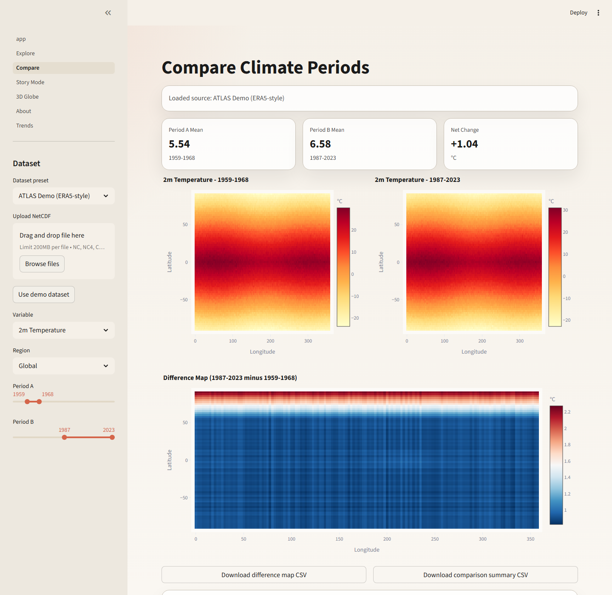

# ATLAS

ATLAS is a multi-page Streamlit climate storytelling app for Hack It Out - Technex'26.

It turns climate NetCDF data into interactive maps, comparisons, narrative walkthroughs, and a globe-based visual experience that works for technical exploration and a judge-facing demo.

## Tagline

Turning Raw Climate Data into Compelling Visual Stories

## Core Pages

- `Home`: polished landing page and project framing
- `Explore`: heatmap, time-series, metrics, anomaly highlights, and insight card
- `Compare`: side-by-side period comparison plus a difference map
- `Trends`: detailed local trend analysis with moving averages and baseline anomalies
- `Story Mode`: guided climate narrative for the final pitch
- `3D Globe`: orthographic climate visualization for the wow moment
- `About`: dataset, methodology, team, and hackathon context

## Key Features

- Synthetic climate demo dataset generated automatically on first launch
- Optional user upload for NetCDF datasets
- Spatial heatmap visualization
- Temporal time-series visualization
- Trend line via linear regression
- Trend-per-decade analysis and moving averages
- Anomaly detection with z-scores
- Auto-generated insight summaries
- Comparison mode with period-over-period difference map
- Guided Story Mode with four narrative steps
- 3D orthographic globe view using Plotly

## Project Structure

```text
app.py
.streamlit/config.toml
pages/
utils/
data/
assets/
requirements.txt
README.md
```

## Local Setup

1. Create and activate a Python 3.10+ environment.
2. Install dependencies:

```bash
pip install -r requirements.txt
```

3. Start the app:

```bash
streamlit run app.py
```

4. On first launch, ATLAS auto-generates `data/demo_temperature.nc` if it is not already present.

## Quick Verification

After setup, you can run a lightweight project smoke test:

```bash
python smoke_check.py
```

Expected result:

```text
ATLAS smoke check passed.
```

## Screenshots

### Home


### Explore


### Compare



### Trends


### Story Mode


### 3D Globe


## Dataset Expectations

ATLAS works best when variables include:

- `time`
- `lat` or `latitude`
- `lon` or `longitude`

The bundled synthetic demo dataset includes:

- `t2m` for 2 m temperature
- `precipitation`
- `sea_level_pressure`
- `wind_speed`

## Demo Strategy

1. Start on `Home` for the value proposition.
2. Open `Explore` and show decades of warming on the map.
3. Click into `Compare` to quantify change.
4. Open `Trends` to show the point-based time evolution and baseline anomaly.
5. Use `Story Mode` as the live pitch.
6. End on `3D Globe` for the memorable finish.

## Deployment Notes

- Deploy on Streamlit Community Cloud with the repository root set to this project folder.
- Use `app.py` as the main entrypoint.
- Keep `data/demo_temperature.nc` committed so the app still works instantly in the cloud.
- If the demo dataset is missing, ATLAS regenerates it on first launch.
- `runtime.txt` is included so the cloud environment uses Python 3.12.

## 2-Minute Pitch Flow

1. Open `Home` and say: climate data should feel as accessible as maps.
2. Open `Explore` and show the latest temperature map, then turn on the timelapse.
3. Show a local trend line to prove the data is queryable, not just pretty.
4. Open `Trends` and highlight the trend-per-decade plus baseline anomaly.
5. Open `Story Mode` and use the four scenes as the main pitch.
6. End on `3D Globe` as the final visual hook.

## Team

- Gaurav Tayde - Lead Developer & Backend Architecture
- Aditya Kumar - Visualization & Frontend Design
- Gaurav Yadav - Feature Development & Data Engineering
- Prem Prakash Singh - Documentation, Testing & Pitch Design
